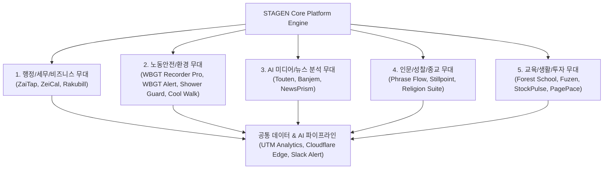
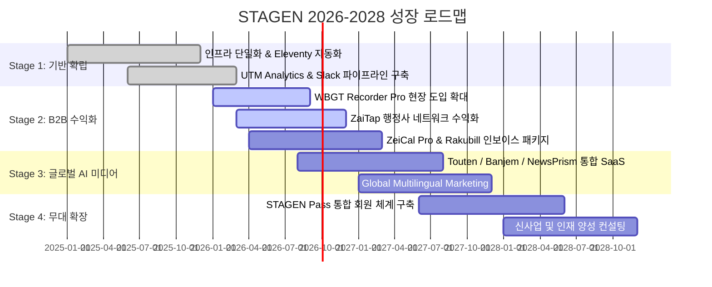

# STAGEN 기업 전략 및 멀티-프로덕트 성장 보고서 (Business Strategy 2026-2028)

> **"사람이 활약할 수 있는 무대는 하나가 아닙니다. 자리 잡을 곳이 늘어날수록 세계도 넓어집니다."**  
> **"We deliver on time, on budget, and on spec."**

---

## 1. Executive Summary (경영 요약)

**STAGEN(스테이젠)**은 다방면의 실용적 무대(Stage)에서 일상의 핵심 문제와 과제를 해결하는 애플리케이션 소프트웨어, 시스템, 미디어 플랫폼을 기획·개발·운영하는 **초효율 1인 법인 스튜디오(Micro-Studio)**입니다.

본 전략서는 STAGEN의 20여 개 개별 제품군을 5대 무대(Domain Cluster)로 체계화하고, 저비용·저유지보수·고신뢰성 기술 기반(Cloudflare Workers, AI Automation, Eleventy Engine)을 활용해 글로벌 시장(일본, 한국, 미국)으로 무대를 확장하는 **2026-2028 심도 통합 성장 전략**을 제시합니다.

---

## 2. 기업 비전 & 핵심 운용 철학

### 2.1 3대 핵심 비전 (Three Vision Pillars)
1. **여러 무대 (Multiple Stages)**: 세금, 노동안전, 미디어, 교육, 성찰 등 삶과 비즈니스의 다양한 접점에서 새로운 도구와 무대를 전개합니다.
2. **세계의 확장 (Expanding Worlds)**: 사용자가 활용할 수 있는 도구와 업무/학습 환경이 늘어남에 따라 개인과 조직의 활동 가능 영역을 확장합니다.
3. **기세와 집행력 (Bold Execution & Iteration)**: 완벽한 서류나 기획보다 빠르게 무대에 서서(Ship Early), 실제 현장 반응을 학습하고 개선합니다.

### 2.2 3대 집행 원칙 (Operational Principles)
* **On Time**: 약속된 배포 및 업데이트 기한 준수
* **On Budget**: 극단적 비용 효율성(Serverless/Edge 중심), 인프라 비용 최소화
* **On Spec**: 요구사양의 완벽한 충족 및 안정적 런타임 보장

---

## 3. 사업 영역 및 제품군 클러스터 분석

STAGEN의 20여 개 애플리케이션은 대상 고객군과 수익 모델에 따라 5대 클러스터로 체계화되어 서로 시너지를 발휘합니다.

| 클러스터 | 대표 제품 | 타깃 고객 | 핵심 가치 제안 (Value Proposition) | Monetization Model |
| :--- | :--- | :--- | :--- | :--- |
| **1. B2B & 행정·세무** | ZaiTap, ZeiCal, Rakubill | 재류자격 신청자, 개인사업자, 법인 경리담당자 | 체류 자격 무료 계산 & 행정사 매칭, 결산월 기반 세무 일정 자동화, 인보이스 대응 청구서 생성 | 프리미엄 위젯 구독, 일회성 앱 구매(¥500), 행정사 수수료 매칭 |
| **2. 노동안전 & 기후** | WBGT Recorder Pro, WBGT Alert, Shower Guard, Cool Walk | 건설/산업 현장 안전관리자, 야외 활동가, 일반 시민 | 법정 온열질환(WBGT) 기록 관리, 국지성 호우 5분 전 알림, UV/미세먼지 종합 외출 판단 | Pro B2B 구독/리포트 수출, 앱 내 프리미엄 기능 |
| **3. AI 미디어 & 뉴스** | Touten, Banjem, NewsPrism | 정치/경제 뉴스 소비인, 미디어 분석가, 연구원 | 주요 5대 언론사 보도 스탠스 2D 맵 시각화, AI 3줄 요약, 매체 간 비교 분석 | AI 심층 해설 Premium 구독, 뉴스레터 |
| **4. 인문·성찰·종교** | Phrase Flow, Stillpoint, Religion 4종 | 직장인, 성찰/명상 입문자, 종교인 | 하루 한 문장 듀얼 관점 성찰, 음성 저널링 기반 소크라테스식 AI 질문 | 월간 구독(AI 대화), 프리미엄 구절 팩 |
| **5. 교육·생활·투자** | Forest School, Fuzen, StockPulse, PagePace | 3-5세 유아, 프로그래밍 입문자, 일본주 투자자, 독서가 | 노광고 안전 교육 게임, AI 시대 함수형 사고 학습, 3층 주식 리스크 분석, 독서 페이스 측정 | 일회성 앱 구매(¥350), 투자 고급 알림 구독 |

---

## 4. 핵심 경쟁력 (Core Competencies)

### 4.1 초스피드 & 고효율 1인 법인 운영 구조
* **Cloudflare Workers & Edge Infrastructure**: 별도의 비싼 VM 인프라 없이 Cloudflare Workers, Pages, D1, KV, Analytics Engine을 활용하여 99.99% 가용성과 거의 0원에 가까운 고정 유지비 달성.
* **Eleventy (11ty) 기반 다국어 자동화 엔진**: 하나의 코드로 일본어(JA), 한국어(KO), 영어(EN) 25+ 페이지 템플릿 자동 빌드 및 static distribution.
* **Slack App 중심 중앙 통제 파이프라인**: 문의 폼, 결제 알림, 서버 헬스체크, UTM 트래픽 수집을 Slack 통합 봇으로 1인 운용 가능하도록 자동화.

### 4.2 매크로 트렌드 선점 및 크로스 프로모션
* **일본 인보이스 제도 & 노동기준법 대응**: ZeiCal, Rakubill, WBGT Recorder Pro 등 규제 변화(Compliance)에 맞춘 필수 B2B 소프트웨어 선점.
* **AI 기반 미디어 3부작 (Touten/Banjem/NewsPrism)**: 동일한 AI 분석 엔진 로직을 일본(Touten), 한국(Banjem), 미국(NewsPrism) 시장에 재활용하여 개발 비용 최소화 및 글로벌 확장.

---

## 5. 2026-2028 중장기 성장 전략 (Strategic Roadmap)

### 5.1 [전략 1] B2B 리드 생성 & B2B SaaS 수익성 강화
* **WBGT Recorder Pro 수주 전략**: 일본 노동기준법 온열질환 대책 의무화 흐름에 맞춰 건설사, 제조 공장, 지자체 대상 연간 구독 패키지(CSV/PDF 법정 제출용 보고서 기능 강조) 판매.
* **ZaiTap 리드 매칭 수익 모델**: 일본 거주 외국인의 재류자격 연장/변경 시, 난이도 높은 건(신규 취업, 비자 변경 등)에 대해 제휴 행정사(行政書士) 매칭 수수료 수입 구조 확립.

### 5.2 [전략 2] AI 미디어 플랫폼 (Touten Trilogy) 통합 및 데이터 자산화
* **글로벌 3개국 동시 커버리지**: 일본(Touten) $\rightarrow$ 한국(Banjem) $\rightarrow$ 미국(NewsPrism)의 5대 언론사 실시간 AI 논조 분석 파이프라인을 단일 AI API로 통합.
* **B2C Premium 서브스크립션**: 편향되지 않은 미디어 소비를 원하는 연구자, 정계/재계 관계자를 위한 'AI 심층 논조 해설' 및 '주간 편향 보고서' 월간 구독 도입.

### 5.3 [전략 3] 크로스 엑세스 & 통합 에코시스템 ("STAGEN Pass")
* **단일 계정/브랜드 인지도 형성**: 20여 개 개별 앱 사용자를 STAGEN 브랜드로 묶는 단일 SSO 또는 크로스 프로모션 위젯 도입.
* **데이터 기반 유기적 교차 마케팅**: ZeiCal(세무) 사용 고객에게 Rakubill(청구) 및 ZaiTap(비자)을 추천하고, WBGT Alert 사용 고객에게 Shower Guard/Cool Walk를 추천하는 스마트 크로스 링킹.

---

## 6. 재무 & KPI 목표

### 6.1 주요 성과 지표 (Key Performance Indicators)
1. **MRR / ARR (월간/연간 반복 매출)**: B2B Pro 기능(WBGT Pro, ZeiCal Pro, Touten Premium) 중심 성장
2. **CAC (고객 획득 비용)**: SEO 최적화 블로그(`src/blog/posts/`) 및 오가닉 검색 중심 $0에 가까운 CAC 유지
3. **App Store / Google Play 평점**: 전 제품 평균 4.6 이상 유지
4. **운영 인프라 비용 비율**: 매출 대비 인프라 비용 < 3% 유지 (Cloudflare Serverless 활용)

### 6.2 3개년 목표치
* **2026년**: B2B 제품군(WBGT Pro, ZeiCal, ZaiTap) 유료 전환율 5% 달성, MAU 10만 달성
* **2027년**: Touten/Banjem/NewsPrism 글로벌 AI 미디어 MAU 50만 달성 및 B2B 구독 수익 정착
* **2028년**: 1인 법인 모델 유지 상태에서 연 매출 안정적 B2B/B2C 포트폴리오 구축

---

## 7. 결론 및 향후 과제

STAGEN은 **"We deliver on time, on budget, and on spec"**이라는 엄격한 개발 원칙 하에, 소수의 대형 단일 앱에 의존하는 대신 **다양한 일상의 무대(Domain-specific Micro-Apps)**를 촘촘히 엮은 지속 가능한 멀티-프로덕트 스튜디오입니다.

본 전략서에 기술된 5대 클러스터 전략 및 PRD 시스템을 바탕으로, 2026년 B2B 컴플라이언스 도구 수익화와 AI 미디어 글로벌 확장을 가속화할 것입니다.
