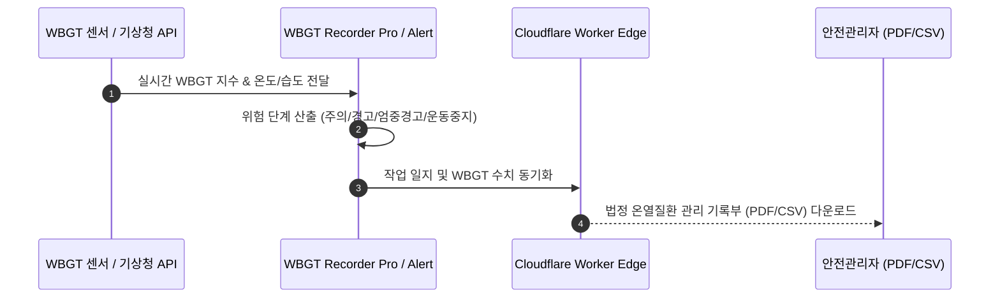

# STAGEN 제품군 통합 PRD (Product Requirement Document)

> **Document Version**: 2.0  
> **Status**: Active / Production Blueprint  
> **Target Audience**: Product Management, Engineering, Operations  
> **Repository Scope**: `prj-githubpage` (https://stage-n.github.io/prj/ & Cloudflare Workers)

---

## 1. 개요 및 제품 비전 (Overview & Product Vision)

본 문서(PRD)는 STAGEN(스테이젠)이 기획·개발·운영하는 20여 개 멀티 프로덕트의 시스템 아키텍처, 데이터 흐름, 핵심 기능 요구사항(Functional Requirements), 비기능 요구사항(Non-Functional Requirements)을 정의합니다.

STAGEN의 모든 제품은 **"We deliver on time, on budget, and on spec"**이라는 품질 원칙과 **"저비용·고효율 1인 운영 모듈식 구조"**를 바탕으로 설계되었습니다.

---

## 2. 공통 플랫폼 아키텍처 (Shared Technical Stack & Core Platform)

모든 STAGEN 제품군 및 랜딩 페이지는 단일화된 공통 인프라 파이프라인 상에서 작동합니다.


### 2.1 공통 모듈 명세
1. **Static Site Generator (Eleventy 11ty)**:
   - `src/pages/`: 언어별(JA, EN, KO) 템플릿 자동 라우팅
   - `src/_includes/bodies/`: 각 앱별 본문 HTML 모듈화
   - `src/_data/i18n.json`: 글로벌 메타데이터 및 다국어 딕셔너리 관리
2. **Edge Worker (`wrangler.jsonc`)**:
   - `ASSETS.fetch`: 정적 HTML/CSS/JS 에지 캐싱 배포
   - UTM analytics engine (`utm_clicks` 데이터셋) 수집
   - `/contact/` 폼 수신 및 Slack 채널 실시간 알림 릴레이
3. **App-to-Web Routing Scheme**:
   - Japanese (Default): `/{app}/index.html`, `/{app}/privacy.html`, `/{app}/support.html`
   - English: `/en/{app}/index.html`, `/en/{app}/privacy.html`, `/en/{app}/support.html`
   - Korean: `/ko/{app}/index.html`, `/ko/{app}/privacy.html`, `/ko/{app}/support.html`

---

## 3. 제품 클러스터별 상세 요구사항 (Product Cluster Specifications)

---

### 3.1 Cluster 1: B2B & 행정·세무 무대 (Administrative & Business Suite)

#### A. ZaiTap (在留手続 - 재류자격 절차 스마트 앱)
* **목적**: 일본 거주 외국인의 비자(재류자격) 연장·변경·갱신 절차 간소화
* **주요 기능**:
  - 스마트폰 카메라를 통한 재류카드 OCR 및 유효기간 자동 추적
  - 자가 신청 가능 여부 진단 진단키트 (무료)
  - 복잡한 신청 건(취업비자 변경, 영주권 신청 등)에 대해 인증 행정사(行政書士) 상담 연결 및 견적 시스템
* **수익 모델**: 행정사 매칭 수수료, 수속 대행 연계
* **기술 사양**: Native iOS/Android, Cloudflare D1 (암호화 유저 메타데이터)

#### B. ZeiCal (세무 캘린더)
* **목적**: 일본 법인 및 개인사업자의 결산월별 세무 일정·신고 기한 자동 산출
* **주요 기능**:
  - 회계연도/결산월 입력 시 법인세, 소비세, 원천세 신고 기한 자동 계산
  - iOS/Android 홈화면 위젯 지원
  - 세금 간이 시뮬레이터 및 납부 알림 푸시 notification
  - 세무서 제출용 일정 PDF/iCal 파일 내보내기
* **수익 모델**: ZeiCal Pro (월간 구독 및 위젯/PDF 풀 해제)

#### C. Rakubill (ラクビル - 인보이스 대응 청구서 앱)
* **목적**: 프리랜서 및 소상공인을 위한 1분 청구서/견적서 작성
* **주요 기능**:
  - 일본 인보이스 제도(T번호 등록) 적격 청구서 양식 지원
  - 견적서 $\rightarrow$ 납품서 $\rightarrow$ 청구서 $\rightarrow$ 영수증 1클릭 변환
  - 입금 상태(미입금, 입금완료, 기한초과) 트래킹 및 CSV 출력
* **수익 모델**: ¥500 일회성 프리미엄 구매 (건수 제한 해제)

---

### 3.2 Cluster 2: 노동안전 & 기후 무대 (Industrial Safety & Climate Health)



#### A. 온열질환 레코더 Pro (WBGT Recorder Pro)
* **목적**: 건설 현장, 공장 등 노동안전위생법 대응 WBGT 수치 측정 및 기록 관리
* **주요 기능**:
  - 실시간 WBGT 지수 표시 및 작업 현장별 측정 데이터 1분 단위 로그
  - 현장 작업자 휴식 타이머 및 경보 아람
  - 노동기준감독서 제출용 법정 WBGT 관리 기록부 (CSV/PDF) 자동 생성
* **수익 모델**: B2B 현장 단위 월간/연간 구독 서비스

#### B. 온열질환 알림 (WBGT Alert)
* **목적**: 일반 사용자 및 야외 활동가를 위한 무료 열사병 예방 앱
* **주요 기능**:
  - 현재 위치 기상 데이터 기반 WBGT 위험도 5단계 알림
  - 개인 프로필(연령, 운동 강도, 복장)에 따른 맞춤형 행동 지침
* **수익 모델**: 무료 제공 (브랜드 인지도 확보 및 B2B 연결)

#### C. Shower Guard
* **목적**: 돌발성 게릴라 호우 대비 초단기(5분 전) 비 알림
* **주요 기능**:
  - 복잡한 기상도 대신 "5분 뒤 비가 오는지 여부"만 초간단 UI로 표시
  - 게릴라 호우 감지 시 강한 진동 및 팝업 알림

#### D. Cool Walk
* **목적**: 야외 외출 최적 타임 제안 (WBGT + UV + 자외선 + 미세먼지)
* **주요 기능**:
  - "지금 외출 추천" vs "30분 후 외출 권장" 쾌적도 지수 시각화

---

### 3.3 Cluster 3: AI 미디어 & 뉴스 분석 무대 (Global AI Media Trilogy)

#### A. Touten (読点 / 읽점 - 일본 5대 일간지 보도 비교)
* **대상 매체**: 요미우리, 아사히, 마이니치, 니혼케이자이, 산케이
* **주요 기능**:
  - 동일 정치/경제 이슈에 대한 5대 매체 헤드라인 나란히 비교
  - AI 기반 보도 스탠스(진보 $\leftrightarrow$ 보수, 정부옹호 $\leftrightarrow$ 비판) 2D 맵 시각화
  - 이슈별 3줄 요약 및 Premium AI 심층 논조 비교 해설

```
[Touten 2D Matrix UI Concept]
          (보수 / Conservative)
                    |
      [산케이]       |      [요미우리]
                    |
(비판) ---------------+---------------+ (옹호)
                    |  [니혼케이자이]
      [마이니치]     |
      [아사히]       |
          (진보 / Progressive)
```

#### B. Banjem (반점 - 한국 5대 언론 보도 비교)
* **대상 매체**: 조선일보, 중앙일보, 동아일보, 한겨레, 경향신문 / 연합뉴스
* **주요 기능**: Touten 엔진 기반 한국 언론 톱기사 AI 논조 및 키워드 편향 분석

#### C. NewsPrism (미국 5대 언론 보도 비교)
* **대상 매체**: The Hill, RealClearPolitics, ProPublica, Daily Kos, Breitbart / NYT, WSJ
* **주요 기능**: 미 대선/정치 이슈에 대한 좌/우 파티잔 논조 및 AI 요약 레이더 맵

---

### 3.4 Cluster 4: 인문·성찰·종교 무대 (Mind & Wisdom Suite)

#### A. Phrase Flow (구절 - Daily Wisdom & Dual Perspectives)
* **주요 기능**: 하루 한 문장 명언 제시 + 해당 명언과 대조되는 역사적/철학적 듀얼 관점 제공 (생각의 확장 유도)

#### B. Phrase Flow Religion Suite (종교 구절 4종)
* **오늘의 말씀 (Christianity)**: 성경 구절과 역사적 맥락
* **오늘의 불경 (Buddhism)**: 불경 구절과 현대적 성찰
* **오늘의 꾸란 (Islam)**: 꾸란 구절과 번역/해설
* **오늘의 종교 구절 (Religion Compare)**: 세계 종교 성구 간 비교 성찰

#### C. Stillpoint (스틸포인트 - Guided Zen & Reflection)
* **주요 기능**:
  - 음성 저널링(Voice Journaling) 기반 일일 성찰 기록
  - AI 소크라테스 프롬프트 엔진: 사용자의 성찰 기록을 분석하여 더 깊은 질문 1개를 반환

---

### 3.5 Cluster 5: 교육·생활·투자 무대 (Education, Lifestyle & Finance)

#### A. Forest School (숲 속 학교 - 유아 교육 게임)
* **타깃**: 3~5세 영유아
* **특징**: 마스코트 '쿠모린'과 함께하는 5가지 퍼즐/색칠 게임. **완전 무광고, 일회성 ¥350 구매**.

#### B. Fuzen (푸젠 - Think in Fuzen)
* **목적**: AI 시대의 컴퓨테이셔널 씽킹 및 함수형 프로그래밍(Functional Thinking) 개념 학습 앱

#### C. StockPulse (스탁펄스 - 일본주 포트폴리오 분석)
* **주요 기능**:
  - 펀더멘털 + 테크니컬 + 수급 3층 분석
  - 기관 공매도 잔고, 신용 잔고 추이, 리스크 급등 알림

#### D. PagePace (페이지페이스 - Reading Rhythm Tracker)
* **주요 기능**: ISBN 바코드 스캔, 세션별 독서 속도(분/페이지) 측정, 독서 습관 캘린더

---

## 4. 비기능 요구사항 (Non-Functional Requirements)

### 4.1 성능 및 가용성 (Performance & Availability)
* **Page Load Speed**: LCP < 1.2s, FID < 100ms, CLS < 0.05 (전 세계 Cloudflare Edge 엣지 배포)
* **Uptime**: 99.95% 이상 달성 (Serverless architecture)

### 4.2 보안 및 프라이버시 (Security & Privacy)
* **개인정보 처리 (GDPR & 일본 개인정보보호법)**:
  - ZaiTap, ZeiCal 등 개인 데이터는 온디바이스(On-device LocalStorage/SQLite) 최우선 저장
  - 서버 전송 시 Cloudflare TLS 1.3 및 D1 AES-256 데이터 암호화 적용

### 4.3 다국어 및 접근성 (i18n & Accessibility)
* **다국어 지원**: Japanese (Default), English, Korean 3개 언어 완벽 지원 (`hreflang` 태그 명시)
* **웹 접근성**: WCAG 2.1 AA 준수 (스크린 리더 대응, 고대비 모드, Canvas 애니메이션 `prefers-reduced-motion` 대응)

---

## 5. 검증 및 출시 기준 (Verification & Release Criteria)

1. **Build Validation**: `npm run build` 실행 시 `_site/` 디렉토리에 오류 없이 25+개 언어별 static HTML 생성 확인
2. **Contact Form & UTM Engine Verification**:
   - `/contact/`, `/en/contact/`, `/ko/contact/` 테스트 제출 시 Slack 채널 알림 도달 검증
   - Cloudflare Analytics Engine `utm_clicks` 데이터 수집 확인
3. **App Store Compliance**: Apple App Store 및 Google Play 개별 정책(프라이버시 정책 URL 연동) 100% 충족.
